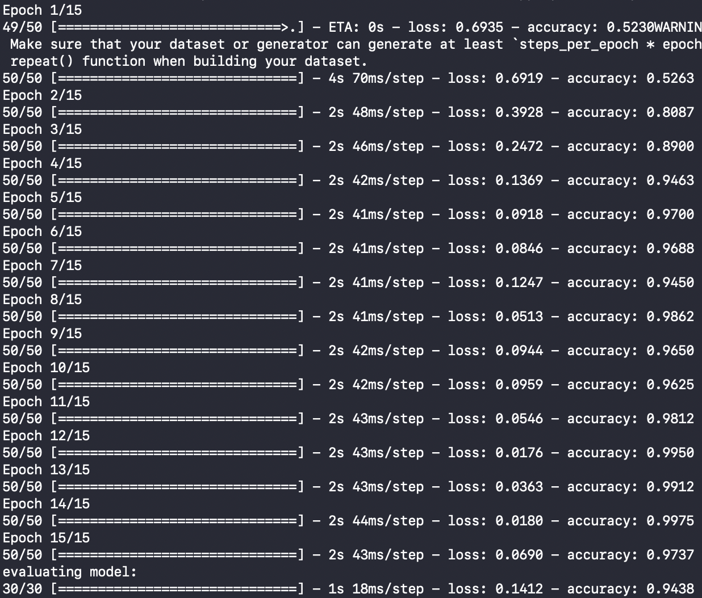

# Music/Speech Recognition with a CNN

### Overview

My goal for this project was to build a dataset of audio segments as spectrograms and classify these audio segments as music or speech using a CNN. I used the [GTZAN](http://marsyas.info/downloads/datasets.html) Music/Speech dataset, which consists of 60 30-second music tracks and 60 30-second speech tracks. This is a relatively small dataset, so after splitting train and test data I segmented each audio track into 10 separate 3-second tracks, resulting in 1200 total audio bits. I converted each track to a mel spectrogram using Librosa. Each 3-second audio bit ended up being a square image like so:

Sample jazz song (music): 
Sample news broadcast (speech): 

### Results

